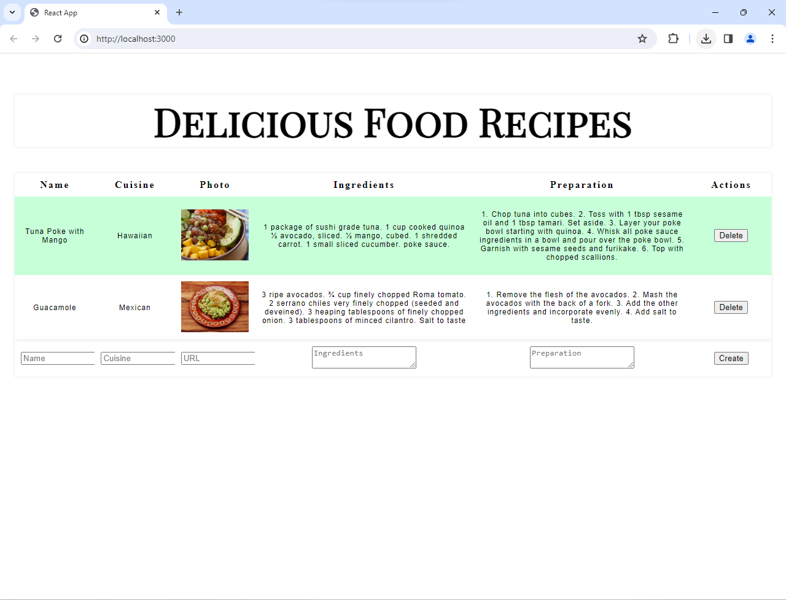
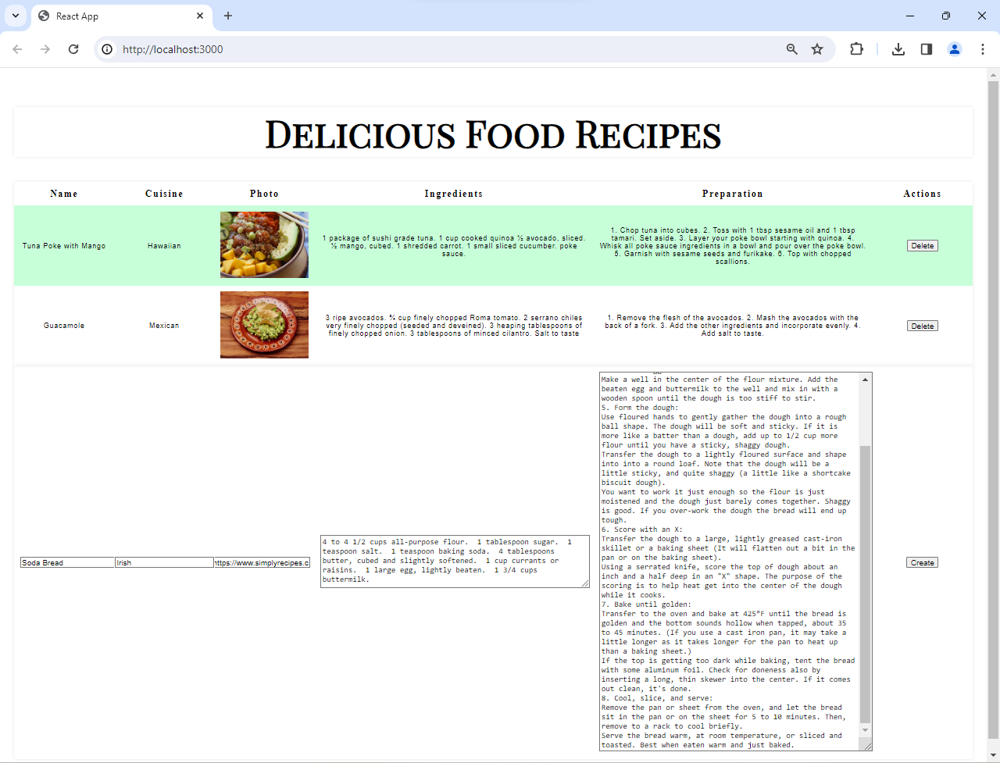
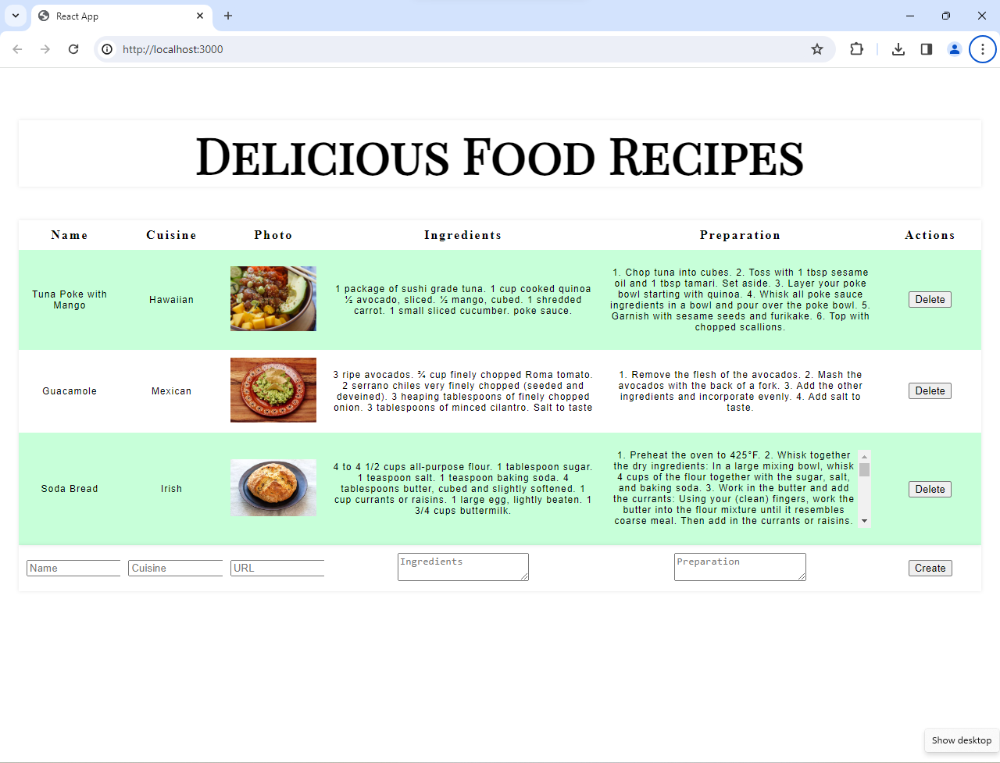

# Recipe Tracker

This is the interface for a food recipe CRUD app:  it allows a user to <i>C</i>reate, <i>R</i>ead, <i>U</i>pdate, or <i>D</i>elete selected data.

* Here it is running at [GitHub pages](https://craig-r-kelly.github.io/Recipe-tracker/).

## Context and Purpose

This React app was written to demonstrate
* componentization into function components in React apps
* rendering
* state management: rather than using a database or an API, it uses React's `useState()` hook.
* user updating of data

## Tools

* JavaScript with React library
* installation of packages with NPM
* React `useState()` hook
* debugging via console output and VS Code debugger

## Screenshots

### Upon initial load, with data from `RecipeData.js`:

### While entering a new recipe, before clicking `Create`:
Notice that image at entered URL is not yet displayed  

### After new recipe has been added:
And now the image itself is displayed 

 
